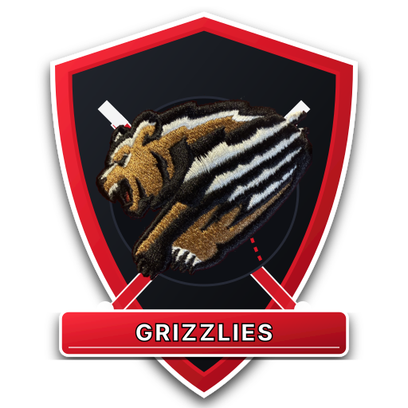

# Wylie Grizzlies Baseball Walk-Up Music App ⚾🔴

A stadium walk-up music soundboard built for the **Wylie Grizzlies (8U Fall 2026)** baseball team, sporting the team's official **Crimson Red, Carbon Black, and Chalk White** colors and cap emblem, optimized for full-screen use on an **iPhone 16 Pro Max** (and responsive across mobile/tablet/desktop).

---

## 🚀 Features

- 📱 **iPhone 16 Pro Max Full-Screen**: Standalone PWA design that supports Dynamic Island and Home Bar safe areas with borderless fullscreen mode.
- 🎛️ **Dugout Soundboard Grid**: High-contrast, large-tap buttons for all 12 players featuring their **jersey numbers**, player full names, walk-up track titles, and live audio equalizer animations.
- 📣 **Stadium Hype Cues**: Quick-trigger buttons for "GET ON YOUR FEET" and "GRIZZLIES FANS" with the official embroidered cap logo.
- ⏳ **Fade Out Controls**:
  - **FADE OUT Button**: One-tap smooth studio exponential fade down to silence.
  - **Fade Duration Slider**: Easily adjust fade out time from **0.5s to 5.0s** (default 2.0s) with quick preset chips (`1s`, `2s`, `3s`, `4s`).
  - **CUT / STOP Button**: Instant kill switch when the batter steps into the box.
  - **Master Volume Fader**: Touch-friendly slider for manual thumb fading.
- 📋 **Batting Lineup & On-Deck Manager**:
  - Set today's batting order (1st through 12th).
  - Automatically identifies the next batter and flags them with an **ON DECK** banner and one-tap **PLAY NEXT →** button.
- 🔍 **Instant Search**: Rapid search by jersey number (e.g. `12`) or player name.

---

## 👥 Player Roster

1. **#6 Charlie Barcelo** — *Hound Dog (Elvis Presley)*
2. **#7 Dash Johnson** — *Tick Tick Boom (The Hives)*
3. **#8 Madoc Willis** — *Save The Day*
4. **#12 Jackson Staley** — *I’m Good (Jelly Roll)*
5. **#13 Tim Helms** — *Run (OneRepublic)*
6. **#14 Jordan Taylor** — *Walk-Up Track*
7. **#15 Stephen** — *Radioactive (Imagine Dragons)*
8. **#18 James Ryder** — *Sure Shot (Beastie Boys)*
9. **#20 Maddox Hurst** — *Walk-Up Track*
10. **#22 West Shields** — *Walk-Up Track*
11. **#56 Jonah Ercan** — *I’m Shipping Up to Boston (Dropkick Murphys)*
12. **#99 Garrett Dowdy** — *Jesus Is Alive*

---

## 📱 How to Run Full-Screen on iPhone

1. Open the app URL in **Safari** on your iPhone.
2. Tap the **Share** button (box with upward arrow).
3. Scroll down and tap **"Add to Home Screen"**.
4. Tap **Add**.
5. Launch the **Grizzlies** icon from your home screen for full-screen mode with zero browser address bars!
